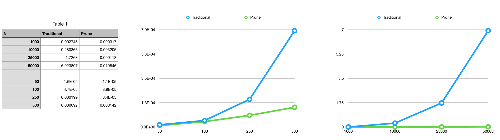

Array Removal in Lua
======

Context
----
I'm working on a project in my spare time which is written in Lua, with Love2D. I'm approaching this project with performance
considerations in mind from the onset, as I intend for this to be able to run at 60fps on less capable hardware (within reason). 

Its early days, but a few patterns about the behavior of the system have started to emerge. 
One such behavior is a need to remove many entities from the system every frame. This entity data is stored in 
arrays, which is wonderful for the majority of the operations being done on them, but atrocious for removal (see problem statement below for _why_). 60fps leaves us with 16ms for all of our processing (1s = 1000ms, 1000ms/60 = 16.66ms), and I certainly 
didn't want to spend it removing entities from the scene. In early testing, I was seeing 12% of that 16ms 
being spent on removals, _surely_ we can do better.

Problem Statement
----
Given some array in lua, _A_ of length _N_: when we remove an element at a non-negative integer index _i_, the removal
will cost us _K = 1 + (N - i)_ operations. This is because all of the elements to the right of our
element _i_ need to be shifted leftwards (+1 for the removal of our element). 
This is true of growable array implementations across most languages, such as std::vector in C++, or ArrayList in Java. 
The exceptions I know of are languages with a _persistent_ implementation such as Clojure's vector type (links below). 

While we may want to have an array for its desirable properties (links below) across other operations we 
are doing with our data, this cost is unfortunate.

Propose Solution
----
All is not lost here, as there _is_ a case in which we can improve this. If we don't
care about the order of our data (which isn't uncommon in my experience), we can be greatly faster. 
If we _do_ care about order of our data, we'll need to find a different data structure.

We achieve this by swapping our element _i_ with the last element, then removing it. This turns our _1 + (N - i)_ operations to _2_.
Effectively taking this from an _O(N)_ algorithm, to an _O(1)_. This is especially valuable, as deletions often
happen in a loop, giving us even more undesirable _O(N^2)_ behavior.

To understand better, lets take a look at some code:
```lua
function remove(t, i)
  t[i], t[#t] = t[#t], t[i]
  table.remove(t,#t)
end
```

When we have many items to remove, as mentioned above, we could wrap this up in a function:
```lua
function prune(t, shouldPrune)
  local i = 1
  while i <= #t do
    if shouldPrune(t[i]) then
      remove(t, i)
    else
      i = i + 1
    end
  end
end
```

Here we've defined a function _prune_, which will do a single linear scan through the array, swapping elements
as described above, if they are to be removed, and popping them off the back.

Performance Analysis
----

I did some simple testing of this to see how the performance shakes out. Filling up two arrays with (the same) random values
then removing elements from one using `table.remove` and the other using `prune`, I got the following results for different 
sizes of arrays.



As we can see, in smaller N, we see a non trivial win, and an even starker disparity in our favor for larger N.

Lesson
----
I think one useful lesson I had reinforced in this exploration, was to remember to fit your solution to the _specifics_ of
your problem. There is often context that only _you_ have, which _you_ can take advantage of.

Links
----
- Lua's:
  - [Main Lua Site](https://www.lua.org/)
  - [Love2D Site](https://love2d.org)
  - [Lua 5's Implementation](https://www.lua.org/doc/jucs05.pdf)
  - [SO Post Covering Array Implementation](https://stackoverflow.com/questions/29928379/how-are-lua-tables-handled-in-memory)
- Clojure's unique vector implementation:
  - [Original Paper, Phil Bagwell: _Ideal Hash Trees_](http://lampwww.epfl.ch/papers/idealhashtrees.pdf)
  - [Jean Niklas L’orange: _Understanding Clojure's Persistent Vector, Pt 1_](https://hypirion.com/musings/understanding-persistent-vector-pt-1)
  - [Jean Niklas L’orange: _Understanding Clojure's Persistent Vector, Pt 2_](https://hypirion.com/musings/understanding-persistent-vector-pt-2)
  - [Jean Niklas L’orange: _Understanding Clojure's Persistent Vector, Pt 3_](https://hypirion.com/musings/understanding-persistent-vector-pt-3)
  - [Chris Okasaki, _Purely Functional Data Structures_](https://www.cs.cmu.edu/~rwh/theses/okasaki.pdf)
- Where and why arrays are often preferrable:
  - [Scott Meyes: _CPU Caches and Why You Care_](https://www.youtube.com/watch?v=WDIkqP4JbkE)
  - [Chandler Carruth: _Efficiency with Algorithms, Performance with Data Structures_](https://www.youtube.com/watch?v=fHNmRkzxHWs)
  - [Eric Brumer, _Native Code Performance on Modern CPUs: A Changing Landscape_](https://channel9.msdn.com/Events/Build/2014/4-587)
- Designing with Performance in Mind:  
  - [Joe Duffy, _Performance Culture_](http://joeduffyblog.com/2016/04/10/performance-culture/)
